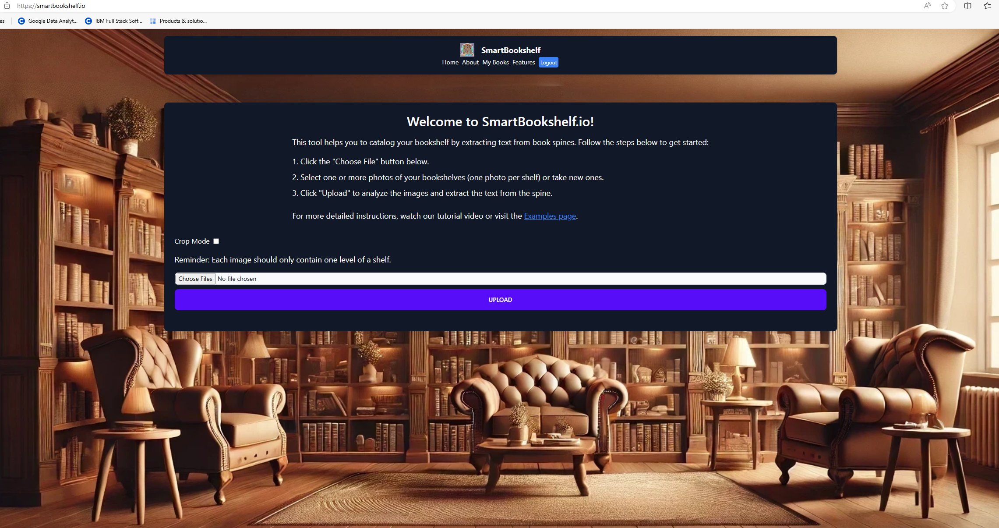
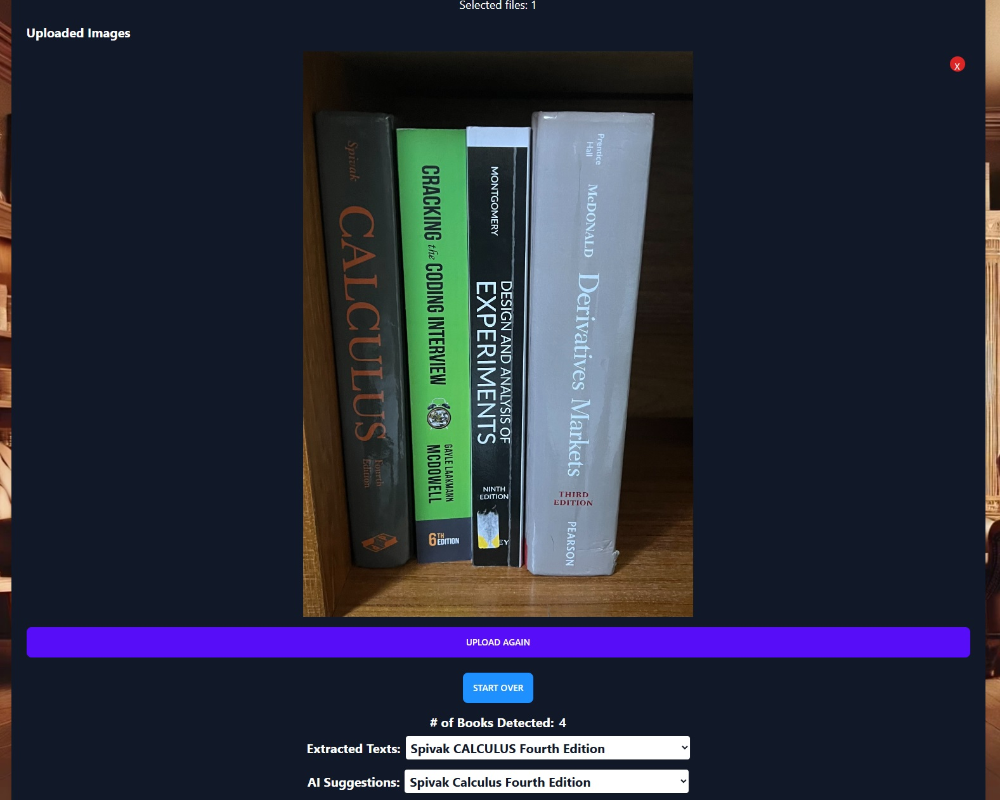

# SmartBookshelf.io

**Welcome!**



SmartBookshelf.io is an innovative application designed to automate the process of cataloging books from images of bookshelves. Utilizing machine learning models for object detection and OCR (Optical Character Recognition), SmartBookshelf.io identifies books, extracts text from their spines, and retrieves detailed information about each book from an external book database and assistance from a Large Language model.

## Features

1. **Book Detection**: Uses the YOLOv5 object detection model to identify and locate books within an image of a bookshelf.
2. **Text Extraction**: Employs Google Cloud Vision API to perform OCR on the detected book regions, extracting relevant text such as titles and authors.
3. **Book Information Retrieval**: Queries an external LLM API using the extracted text to fetch detailed book information and attempt to match to the least likely book.
4. **Visualization**: Displays the cropped detected books, along with the extracted text and book information.
5. **Cropped Images**: Saves cropped images of detected books for further processing or verification.

## Installation

### Prerequisites

- Python 3.12
- Google Cloud Vision API credentials
- Firestore Database
- [Tesseract-OCR](https://github.com/tesseract-ocr/tesseract)

### Setup

1. **Clone the repository**:
    ```bash
    git clone https://github.com/yourusername/SmartBookshelf.io.git
    cd SmartBookshelf.io
    ```

2. **Create a virtual environment**:
    ```bash
    python -m venv .venv
    source .venv/bin/activate  # On Windows use `.venv\Scripts\activate`
    ```

3. **Install dependencies**:
    ```bash
    pip install -r requirements.txt
    ```

4. **Set up Google Cloud Vision API**:
    - **Enable the API**: 
      - Go to the [Google Cloud Console](https://console.cloud.google.com/).
      - Create a new project or select an existing project.
      - Enable the Google Cloud Vision API for your project.
    - **Create a Service Account**: 
      - Navigate to **IAM & Admin** > **Service Accounts**.
      - Click **Create Service Account**.
      - Provide a name and description for the service account.
      - Assign the role **Project** > **Editor** and **Viewer**.
      - Click **Done**.
    - **Generate the Key**:
      - After creating the service account, click on it to open its details.
      - Navigate to the **Keys** tab and click **Add Key** > **Create new key**.
      - Select **JSON** and click **Create**. A JSON file will be downloaded to your computer. This is your `credentials.json` file.
    - **Place the `credentials.json` file**:
      - Move the downloaded `credentials.json` file to the `backend/scripts` directory of your project.
    - **Set the environment variable for Google Application Credentials**:
        ```bash
        export GOOGLE_APPLICATION_CREDENTIALS="backend/scripts/credentials.json"
        # On Windows use `set GOOGLE_APPLICATION_CREDENTIALS=backend\scripts\credentials.json`
        ```
    - **Example of a `credentials.json` file**:
      ```json
      {
        "type": "service_account",
        "project_id": "smartshelf-426516",
        "private_key_id": "replace_with_private_key_id",
        "private_key": "replace_with_private_key",
        "client_email": "vision-api-sa@smartshelf-426516.iam.gserviceaccount.com",
        "client_id": "108005887996655358330",
        "auth_uri": "https://accounts.google.com/o/oauth2/auth",
        "token_uri": "https://oauth2.googleapis.com/token",
        "auth_provider_x509_cert_url": "https://www.googleapis.com/oauth2/v1/certs",
        "client_x509_cert_url": "https://www.googleapis.com/robot/v1/metadata/x509/vision-api-sa%40smartshelf-426516.iam.gserviceaccount.com",
        "universe_domain": "googleapis.com"
      }
      ```

5. **Install Tesseract-OCR**:
    - Download and install Tesseract-OCR from [here](https://github.com/tesseract-ocr/tesseract).
    - Add Tesseract-OCR to your system PATH.

## Usage

### Detect Books and Extract Information

1. **Run the script**:
    ```bash
    python backend/scripts/extract_books.py
    ```

2. **View results**:
    - The script will process the `IMG_6464.jpeg` image located in the `backend/scripts/test_images` directory.
    - The original image with bounding boxes around detected books will be displayed.
    - Cropped images and extracted text will be saved and printed in the console.
    - Combined images with detected text will be saved in the `cropped_books` directory.

## Example

**Example image of a bookshelf:**



## Deployment

SmartBookshelf.io is designed to be deployed on Google Cloud using various Google Cloud services for seamless scalability and integration. The application uses:
- **Google Cloud Run** for serverless deployment of the application.
- **Google Cloud Vision API** for OCR capabilities.

### Deployment Steps

1. **Build the Docker image**:
    ```bash
    docker build -t smartshelf .
    ```

2. **Deploy to Google Cloud Run**:
    ```bash
    gcloud run deploy smartshelf --image gcr.io/your-project-id/smartshelf --platform managed --region your-region --allow-unauthenticated
    ```

3. **Set environment variables** for Google Cloud Vision API credentials in Google Cloud Run.

## Contributing

Contributions are welcome! Please open an issue or submit a pull request for any improvements or bug fixes.

## License

This project is licensed under the MIT License.
