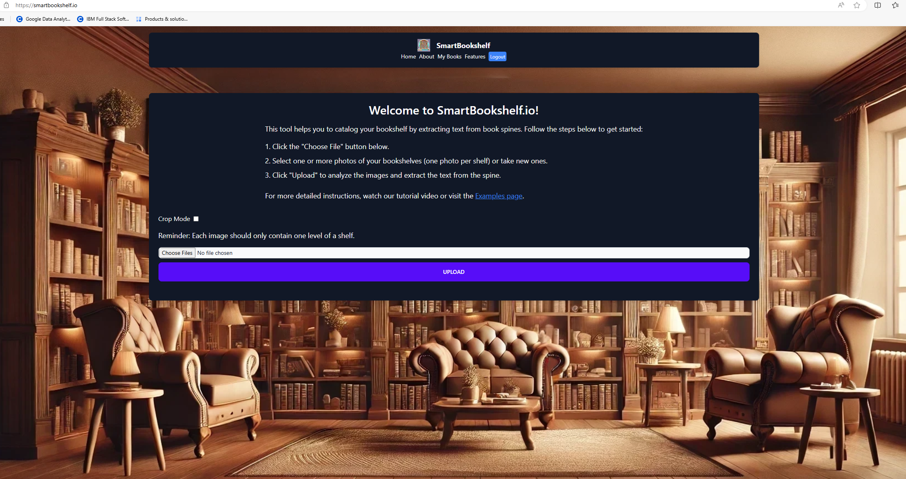
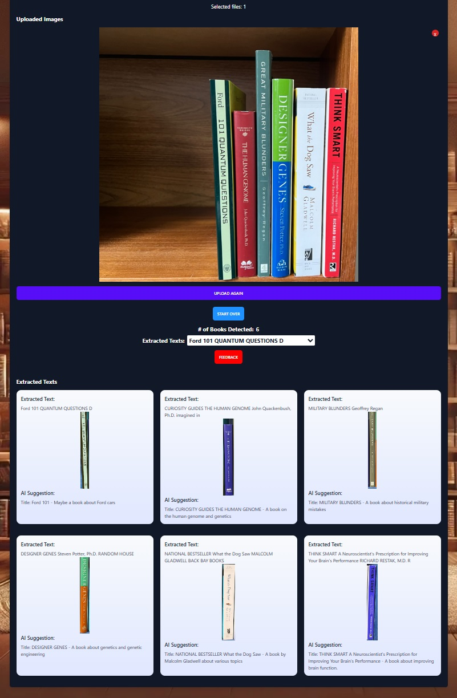

# SmartBookshelf.io

SmartBookshelf turns bookshelf photos into a digital book list by combining book detection, OCR, and cleanup.

[Live site](https://www.smartbookshelf.io)  
[Current frontend source](https://github.com/Robby955/SmartBookshelfV3)  
[Demo video](https://www.youtube.com/watch?v=bgk3Jo_8e00)

## What this repository is

This public repository is the earlier SmartBookshelf codebase.

- `backend/` contains the earlier Flask backend and image-processing pipeline
- `my-app/` contains the earlier Next.js frontend and product prototype
- `images/` contains public screenshots used in the repo README

The live site has moved forward since this code snapshot. The current production-facing frontend is maintained in `SmartBookshelfV3`.

## What the public code shows

From the code in this repository, the earlier SmartBookshelf pipeline included:

- YOLOv5-based book detection
- per-book crop generation
- Google Cloud Vision OCR
- Google Cloud Storage for cropped images
- Firestore storage for upload records

That stack is visible in [`backend/app.py`](backend/app.py).

## Why the project exists

Shelf photos are harder than normal OCR inputs:

- book spines are narrow and often partly blocked
- text can be vertical, curved, low-contrast, or stylized
- shelf photos are sensitive to glare, angle, and distance
- partial OCR fragments still need to be turned into usable book matches

SmartBookshelf was built to handle that workflow instead of treating a bookshelf like a flat document scan.

## Project status

- Production site: [smartbookshelf.io](https://www.smartbookshelf.io)
- Current live frontend repo: [Robby955/SmartBookshelfV3](https://github.com/Robby955/SmartBookshelfV3)
- Public historical repo: [Robby955/SmartBookshelf.io](https://github.com/Robby955/SmartBookshelf.io)

If you want the current live UI code, use `SmartBookshelfV3`. If you want the earlier backend and prototype code, use this repository.

## Screenshots

- [Welcome screenshot](images/welcome.png)
- [Results screenshot](images/resultspage.png)

